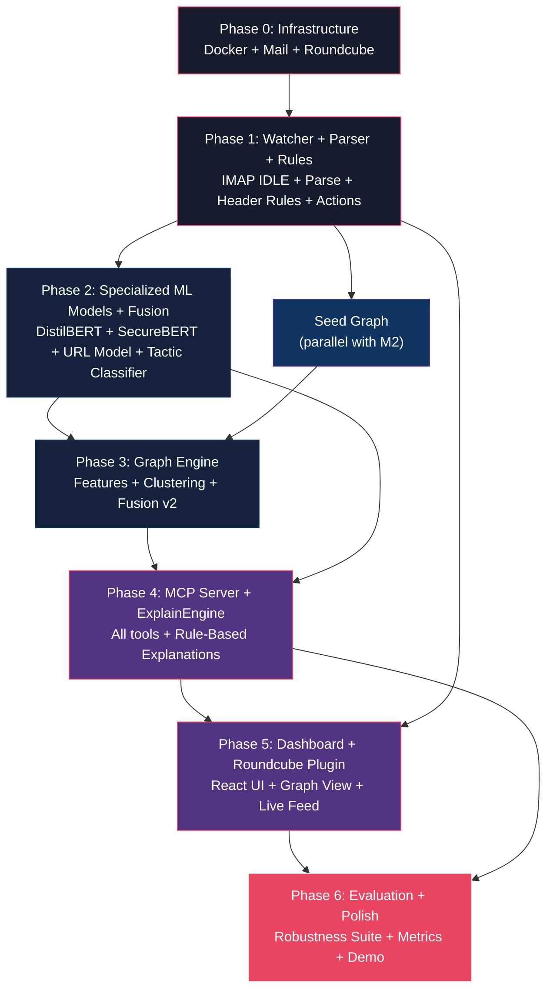

# PhishGuard — Detailed Implementation Plan

> Derived from [PSN013_phishing_detection_build_plan.md](file:///home/ragnarok/Documents/projects/BnB/PSN013_phishing_detection_build_plan.md)

---

## Table of Contents

1. [Executive Summary](#1-executive-summary)
2. [Tech Stack & Dependencies](#2-tech-stack--dependencies)
3. [Repository Bootstrap](#3-repository-bootstrap)
4. [Phase 0 — Infrastructure (M0: h0–2)](#4-phase-0--infrastructure-m0-h02)
5. [Phase 1 — Watcher, Parser & Rules Engine (M1: h2–6)](#5-phase-1--watcher-parser--rules-engine-m1-h26)
6. [Phase 2 — ML Models & Fusion (M2: h6–14)](#6-phase-2--ml-models--fusion-m2-h614)
7. [Phase 3 — Graph Engine (M3: h14–20)](#7-phase-3--graph-engine-m3-h1420)
8. [Phase 4 — MCP Server & Explanation Engine (M4: h20–26)](#8-phase-4--mcp-server--deterministic-explanation-engine-m4-h2026)
9. [Phase 5 — Dashboard & Roundcube Integration (M5: h26–31)](#9-phase-5--dashboard--roundcube-integration-m5-h2631)
10. [Phase 6 — Evaluation, Robustness & Polish (M6–M7: h31–36)](#10-phase-6--evaluation-robustness--polish-m6m7-h3136)
11. [Cross-Cutting Concerns](#11-cross-cutting-concerns)
12. [Risk Contingency Matrix](#12-risk-contingency-matrix)
13. [Cut-Line Strategy](#13-cut-line-strategy)
14. [Dependency Graph](#14-dependency-graph)

---

## 1. Executive Summary

**PhishGuard** is a real-time, fully local AI phishing detection system. It monitors an IMAP mailbox via IMAP IDLE, runs every incoming email through a multi-model detection pipeline (header rules, URL classifier, **security-domain NLP classifiers**, graph engine), fuses verdicts, and generates **deterministic, template-driven explanations** from SHAP feature attributions. No generative LLM is used — all reasoning is explainable, reproducible, and instant. Actions (quarantine, flag, banner) are executed via an MCP-compliant tool server and are visible live in both Roundcube webmail and a React dashboard.

**5 Key Differentiators:**
1. **Specialized security-domain NLP** — SecureBERT 2.0 embeddings + DistilBERT phishing classifier (not a generic LLM)
2. Graph analysis (sender–domain–URL–IP relationships, campaign clustering)
3. Evasion resistance (homoglyphs, zero-width chars, QR codes, LLM-paraphrased text)
4. **MCP-controlled deterministic agent** — SHAP-powered explanations, zero prompt injection risk
5. Real email client experience (Roundcube login → protection auto-starts)

---

## 2. Tech Stack & Dependencies

### Core Runtime

| Layer | Technology | Version / Notes |
|---|---|---|
| Language | Python 3.11 | Backend, ML, MCP server |
| Web framework | FastAPI + Uvicorn | REST + WebSocket endpoints |
| IMAP client | `imapclient` | IMAP IDLE support |
| Email parsing | `email` stdlib + `mail-parser` + `BeautifulSoup4` | Header/body/HTML extraction |
| Database | SQLite (via `aiosqlite`) | Events, feedback, audit, graph snapshots |
| Config | `pydantic-settings` + YAML (`PyYAML`) | `policy.yaml` + `.env` |
| Logging | `structlog` | JSON structured logging |
| Task management | `asyncio` | Per-mailbox watcher tasks |

### ML & NLP — Specialized Lightweight Models

| Component | Technology | Model / Notes |
|---|---|---|
| **Text classifier (primary)** | `transformers` + `onnxruntime` | [`cybersectony/phishing-email-detection-distilbert_v2.1`](https://huggingface.co/cybersectony/phishing-email-detection-distilbert_v2.1) — 66M params, phishing-specialized, ONNX int8 |
| **Security embeddings** | `transformers` + `onnxruntime` | [`ehsanaghaei/SecureBERT`](https://huggingface.co/ehsanaghaei/SecureBERT) (or `cisco-ai/SecureBERT2.0` if available) — cybersecurity-domain encoder for feature extraction |
| **Phishing URL classifier** | `transformers` + `onnxruntime` | [`ealvaradob/bert-finetuned-phishing`](https://huggingface.co/ealvaradob/bert-finetuned-phishing) — URL/email/SMS phishing detection |
| URL feature model | `lightgbm` | Lexical features + feed hits + lookalike scores |
| Fusion meta-model | `lightgbm` or `sklearn.linear_model.LogisticRegression` | Isotonic calibration over all component outputs |
| Explainability | `shap` + **rule-based `ExplainEngine`** | Deterministic templates driven by SHAP attributions — no LLM |
| Multi-label tactic classifier | `transformers` + `onnxruntime` | Fine-tuned DistilBERT multi-label head: urgency, authority, credential_request, payment, link_bait, attachment_lure |
| OCR | `rapidocr-onnxruntime` | Image text extraction |
| QR decode | `pyzbar` | QR code URL extraction |
| Homoglyph handling | `confusables` / custom Unicode table | Confusable character folding |
| NLP preprocessing | `unicodedata` (NFKC), regex | Normalization pipeline |

### Graph

| Component | Technology |
|---|---|
| Graph store | `networkx` (in-memory) + SQLite persistence |
| Clustering | Louvain (`community` package) / label propagation |
| Near-duplicate | `datasketch` (MinHash/LSH) |
| Visualization (backend) | JSON subgraph export |
| Optional upgrade | PyTorch Geometric (GraphSAGE/GAT) |

### Explanation Engine (replaces LLM)

| Component | Technology |
|---|---|
| Explanation generation | **Rule-based `ExplainEngine`** — deterministic templates driven by SHAP feature attributions, component scores, and graph context |
| Tactic identification | Multi-label classifier output (urgency, authority, credential_request, etc.) |
| MCP SDK | `mcp` (FastMCP, Python SDK) |
| Transport | SSE/streamable-HTTP for external clients (Claude Desktop, MCP Inspector) |

> [!TIP]
> **Why no LLM?** Generative models add latency (seconds), resource overhead (4GB+ VRAM/RAM), non-determinism, and prompt injection risk — all unacceptable in a security product. The specialized classifiers are **faster** (< 50ms), **deterministic**, and **immune to prompt injection**.

### Frontend

| Component | Technology |
|---|---|
| Dashboard | React 18 + Vite + Tailwind CSS |
| Graph visualization | Cytoscape.js |
| Real-time | WebSocket (native) |
| Fallback UI | Plain HTML + htmx (if time-constrained) |

### Infrastructure

| Component | Technology |
|---|---|
| Mail server | `docker-mailserver` (Postfix + Dovecot) |
| Webmail | Roundcube (Docker) |
| Orchestration | Docker Compose |
| Demo mail injection | `swaks` / `smtplib` |

---

## 3. Repository Bootstrap

### Directory Structure (create all at once)

```
phishguard/
├── docker-compose.yml
├── Dockerfile.backend
├── Dockerfile.dashboard
├── README.md
├── .env.example
├── .gitignore
├── Makefile                          # make dev, make eval, make demo
├── config/
│   └── policy.yaml                   # thresholds, brands, feeds, timeouts
├── data/
│   ├── raw/                          # .gitignored
│   ├── processed/                    # .gitignored
│   └── feeds/                        # PhishTank/OpenPhish cached JSONs
├── notebooks/
│   ├── train_text_model.ipynb        # fine-tune DistilBERT / SecureBERT on phishing
│   └── train_tactic_classifier.ipynb # multi-label tactic head training
├── guard/
│   ├── __init__.py
│   ├── config.py                     # pydantic-settings, load policy.yaml
│   ├── models.py                     # shared pydantic models (ParsedEmail, Verdict, etc.)
│   ├── parse/
│   │   ├── __init__.py
│   │   ├── parser.py                 # main email parser
│   │   ├── normalizer.py             # anti-evasion normalization
│   │   ├── ocr.py                    # image OCR + QR decode
│   │   └── html_sanitizer.py         # HTML stripping, hidden text detection
│   ├── headers/
│   │   ├── __init__.py
│   │   └── rules.py                  # SPF/DKIM/DMARC checks, header heuristics
│   ├── url/
│   │   ├── __init__.py
│   │   ├── features.py               # lexical feature extraction
│   │   ├── lookalike.py              # Levenshtein + homoglyph distance
│   │   ├── intel.py                  # feed lookups (PhishTank, etc.)
│   │   ├── redirect.py              # sandboxed redirect expansion
│   │   └── model.py                  # LightGBM URL classifier
│   ├── nlp/
│   │   ├── __init__.py
│   │   ├── encoder.py                # ONNX transformer inference
│   │   └── preprocess.py             # tokenization, truncation strategy
│   ├── graph/
│   │   ├── __init__.py
│   │   ├── engine.py                 # NetworkX graph manager
│   │   ├── features.py              # graph-derived features
│   │   ├── clustering.py            # campaign detection (MinHash + Louvain)
│   │   └── persistence.py           # SQLite serialization
│   ├── fusion/
│   │   ├── __init__.py
│   │   └── meta_model.py            # stacking + calibration + SHAP reasons
│   ├── explainer/
│   │   ├── __init__.py
│   │   ├── engine.py                 # rule-based ExplainEngine (SHAP → templates)
│   │   ├── templates.py             # explanation template library
│   │   └── tactics.py               # multi-label tactic classifier wrapper
│   ├── watcher/
│   │   ├── __init__.py
│   │   └── imap_watcher.py          # IMAP IDLE, reconnect, UID tracking
│   ├── mcp_server/
│   │   ├── __init__.py
│   │   └── server.py                # FastMCP tools, resources, prompts
│   ├── api/
│   │   ├── __init__.py
│   │   ├── app.py                    # FastAPI app factory
│   │   ├── routes/
│   │   │   ├── sessions.py           # POST /sessions (start watcher)
│   │   │   ├── events.py             # WebSocket /events (live feed)
│   │   │   ├── feedback.py           # POST /feedback (false positive/negative)
│   │   │   ├── graph.py              # GET /graph (subgraph queries)
│   │   │   └── analysis.py           # GET /analysis/{uid} (verdict details)
│   │   └── middleware.py             # CORS, error handling
│   └── store/
│       ├── __init__.py
│       ├── database.py               # SQLite schema, connection pool
│       ├── events.py                 # event CRUD
│       ├── audit.py                  # append-only audit log
│       └── feedback.py              # feedback records
├── roundcube_plugin/
│   └── phishguard/
│       ├── phishguard.php            # login_after hook + banner renderer
│       └── config.inc.php.dist       # plugin config template
├── dashboard/
│   ├── package.json
│   ├── vite.config.js
│   ├── index.html
│   ├── src/
│   │   ├── App.jsx
│   │   ├── main.jsx
│   │   ├── index.css                 # Tailwind base
│   │   ├── components/
│   │   │   ├── LiveFeed.jsx          # real-time verdict stream
│   │   │   ├── VerdictCard.jsx       # individual email verdict
│   │   │   ├── GraphView.jsx         # Cytoscape.js graph
│   │   │   ├── ExplanationPanel.jsx  # deterministic explanation display
│   │   │   ├── CampaignList.jsx      # campaign cluster list
│   │   │   ├── StatsBar.jsx          # counters, latency
│   │   │   └── FeedbackButton.jsx    # "Not phishing" action
│   │   └── hooks/
│   │       ├── useWebSocket.js       # WS connection manager
│   │       └── useApi.js             # REST client
│   └── tailwind.config.js
├── scripts/
│   ├── download_datasets.py
│   ├── build_features.py
│   ├── train_url.py
│   ├── train_fusion.py
│   ├── seed_graph.py
│   ├── send_demo_mail.py             # swaks/smtplib phish + ham injector
│   └── export_onnx.py               # transformer → ONNX int8
└── tests/
    ├── conftest.py
    ├── test_parser.py
    ├── test_normalizer.py
    ├── test_header_rules.py
    ├── test_url_features.py
    ├── test_graph_features.py
    ├── test_fusion.py
    ├── test_mcp_tools.py
    ├── test_e2e_quarantine.py        # send → quarantine integration test
    ├── test_robustness.py            # evasion suite
    └── test_injection.py            # prompt injection payloads
```

### Initial Files to Create

```yaml
# .env.example
MAIL_DOMAIN=demo.local
MAIL_ADMIN_USER=admin@demo.local
MAIL_ADMIN_PASS=changeme
DOVECOT_MASTER_USER=backend
DOVECOT_MASTER_PASS=changeme
SQLITE_PATH=/data/phishguard.db
LOG_LEVEL=INFO
# No Ollama/LLM runtime needed — all models run via ONNX
TEXT_MODEL=cybersectony/phishing-email-detection-distilbert_v2.1
SECURITY_ENCODER=ehsanaghaei/SecureBERT
URL_PHISH_MODEL=ealvaradob/bert-finetuned-phishing
```

---

## 4. Phase 0 — Infrastructure (M0: h0–2)

> **Goal:** `docker compose up` → Roundcube login → receive a mail via `send_demo_mail.py`

### Tasks

#### 4.1 Docker Compose Stack

| Task | File | Details |
|---|---|---|
| 4.1.1 | `docker-compose.yml` | Define services: `mailserver` (docker-mailserver), `roundcube`, `backend` (Python), `dashboard` (Node/Vite dev server) |
| 4.1.2 | `docker-compose.yml` | Configure `mailserver`: volumes for config/data, env vars for `PERMIT_DOCKER=network`, `POSTFIX_INET_PROTOCOLS=ipv4`, disable ClamAV/SpamAssassin (unnecessary), enable Dovecot master user |
| 4.1.3 | `docker-compose.yml` | Configure `roundcube`: link to mailserver IMAP, set `ROUNDCUBEMAIL_DEFAULT_HOST`, `ROUNDCUBEMAIL_SMTP_SERVER` |
| 4.1.4 | `docker-compose.yml` | Configure volumes: persistent mail data, SQLite data, shared model artifacts |
| 4.1.5 | `docker-compose.yml` | Network: single bridge network `phishguard-net`, all services on it |

#### 4.2 Mailbox Setup

| Task | File | Details |
|---|---|---|
| 4.2.1 | `config/mailserver/postfix-accounts.cf` | Create demo mailboxes: `victim@demo.local`, `attacker@demo.local`, `boss@demo.local` |
| 4.2.2 | `config/mailserver/dovecot-master.cf` | Configure Dovecot master user for backend IMAP access |
| 4.2.3 | DNS/hosts | Add `demo.local` to `/etc/hosts` or use Docker DNS |

#### 4.3 Demo Mail Script

| Task | File | Details |
|---|---|---|
| 4.3.1 | `scripts/send_demo_mail.py` | Python script using `smtplib` to send test emails (5 types from demo script): obvious phish, CEO fraud, homoglyph phish, QR-only phish, legitimate newsletter |
| 4.3.2 | `scripts/send_demo_mail.py` | Parameterized: `--type {phish,ceo_fraud,homoglyph,qr,legit,all}`, `--from`, `--to`, `--smtp-host` |

#### 4.4 Backend Skeleton

| Task | File | Details |
|---|---|---|
| 4.4.1 | `Dockerfile.backend` | Python 3.11-slim, install system deps (tesseract, zbar libs), pip install from `requirements.txt` |
| 4.4.2 | `requirements.txt` | Pin all dependencies |
| 4.4.3 | `guard/api/app.py` | Minimal FastAPI app with healthcheck endpoint |
| 4.4.4 | `guard/config.py` | Pydantic settings: load `.env` + `config/policy.yaml` |

#### 4.5 Validation Criteria

- [ ] `docker compose up -d` starts all services without errors
- [ ] Roundcube accessible at `http://localhost:8080` (or configured port)
- [ ] Login as `victim@demo.local` succeeds
- [ ] `python scripts/send_demo_mail.py --type legit` → email appears in Roundcube inbox
- [ ] Backend healthcheck at `http://localhost:8000/health` returns 200

---

## 5. Phase 1 — Watcher, Parser & Rules Engine (M1: h2–6)

> **Goal:** IMAP IDLE watcher detects new mail → parses → runs header rules → quarantines/flags → visible in Roundcube within 5 seconds

### Tasks

#### 5.1 SQLite Schema & Store

| Task | File | Details |
|---|---|---|
| 5.1.1 | `guard/store/database.py` | Schema: `emails` (uid, mailbox, subject, sender, received_at, raw_headers_json), `verdicts` (uid, score, verdict, reasons_json, component_scores_json, created_at), `audit_log` (id, uid, action, reason, timestamp), `feedback` (id, uid, label, user, timestamp) |
| 5.1.2 | `guard/store/events.py` | CRUD: `save_email()`, `save_verdict()`, `get_verdict()`, `list_recent()` |
| 5.1.3 | `guard/store/audit.py` | `log_action(uid, action, reason)` — append-only, never update/delete |

#### 5.2 Pydantic Models

| Task | File | Details |
|---|---|---|
| 5.2.1 | `guard/models.py` | `ParsedEmail`: subject, from_addr, from_display, reply_to, return_path, received_chain, spf/dkim/dmarc results, body_plain, body_html, visible_text, urls (list with href + display text), attachments (filename, type, size, has_macros), extracted_image_text, extracted_qr_urls, normalized_body, raw_headers |
| 5.2.2 | `guard/models.py` | `URLInfo`: raw_url, normalized, domain, tld, is_punycode, display_text_mismatch |
| 5.2.3 | `guard/models.py` | `Verdict`: uid, score (float 0–1), level (ALLOW/FLAG/BLOCK), reasons (list[str]), component_scores (dict), explanation (optional str), timestamp |
| 5.2.4 | `guard/models.py` | `AuditEntry`: uid, action, reason, timestamp |

#### 5.3 Email Parser

| Task | File | Details |
|---|---|---|
| 5.3.1 | `guard/parse/parser.py` | `parse_email(raw_bytes) → ParsedEmail`: use `email.message_from_bytes()` + `mail-parser` for robust MIME handling |
| 5.3.2 | `guard/parse/parser.py` | Extract all headers: From, Reply-To, Return-Path, Received chain, Authentication-Results (parse SPF/DKIM/DMARC) |
| 5.3.3 | `guard/parse/parser.py` | Extract body: plain text + HTML parts; use BeautifulSoup to get visible text |
| 5.3.4 | `guard/parse/parser.py` | Extract URLs: all `href` attributes from `<a>` tags + URL regex on plain text; capture display text vs href mismatch |
| 5.3.5 | `guard/parse/parser.py` | Extract attachments: filename, MIME type, size, extension mismatch detection (e.g., `.pdf.exe`) |

#### 5.4 Anti-Evasion Normalizer

| Task | File | Details |
|---|---|---|
| 5.4.1 | `guard/parse/normalizer.py` | `normalize_text(text) → str`: Unicode NFKC normalization |
| 5.4.2 | `guard/parse/normalizer.py` | Strip zero-width characters (U+200B, U+200C, U+200D, U+FEFF, U+2060) |
| 5.4.3 | `guard/parse/normalizer.py` | Strip bidirectional override chars (U+202A–U+202E, U+2066–U+2069) |
| 5.4.4 | `guard/parse/normalizer.py` | Homoglyph folding: map confusable characters to ASCII equivalents (use `confusables` lib or custom mapping table) |
| 5.4.5 | `guard/parse/normalizer.py` | Decode HTML entities, collapse whitespace |
| 5.4.6 | `guard/parse/normalizer.py` | `normalize_url(url) → str`: decode percent-encoding, remove `hxxp`→`http`, `[.]`→`.`, strip tracking params |
| 5.4.7 | `guard/parse/html_sanitizer.py` | Detect hidden text: `display:none`, `visibility:hidden`, white-on-white text, font-size:0/1px |
| 5.4.8 | `guard/parse/html_sanitizer.py` | Extract hidden text separately (feature for classifier) |

#### 5.5 Image Processing (OCR + QR)

| Task | File | Details |
|---|---|---|
| 5.5.1 | `guard/parse/ocr.py` | `extract_text_from_image(image_bytes) → str`: use `rapidocr-onnxruntime` |
| 5.5.2 | `guard/parse/ocr.py` | `extract_qr_urls(image_bytes) → list[str]`: use `pyzbar` to decode QR codes |
| 5.5.3 | `guard/parse/parser.py` | For each image attachment / inline image: run OCR + QR, feed results back into `ParsedEmail.extracted_image_text` and `extracted_qr_urls` |

#### 5.6 Header Rules Engine

| Task | File | Details |
|---|---|---|
| 5.6.1 | `guard/headers/rules.py` | `check_authentication(parsed) → dict`: SPF fail, DKIM fail, DMARC fail → boolean features |
| 5.6.2 | `guard/headers/rules.py` | `check_header_anomalies(parsed) → dict`: From-domain ≠ Return-Path domain, Reply-To differs from From, display-name impersonating brand while domain differs |
| 5.6.3 | `guard/headers/rules.py` | `check_sender_reputation(parsed, graph) → dict`: newly seen sender, punycode/IDN domain, suspicious Received chain hops |
| 5.6.4 | `guard/headers/rules.py` | `get_header_features(parsed) → np.ndarray`: combine all into a feature vector for fusion |

#### 5.7 IMAP Watcher

| Task | File | Details |
|---|---|---|
| 5.7.1 | `guard/watcher/imap_watcher.py` | `MailboxWatcher` class: connects via IMAP using master user credentials, starts IDLE loop |
| 5.7.2 | `guard/watcher/imap_watcher.py` | UID tracking: persist `last_processed_uid` in SQLite; process each UID exactly once |
| 5.7.3 | `guard/watcher/imap_watcher.py` | Reconnect with exponential backoff on disconnect |
| 5.7.4 | `guard/watcher/imap_watcher.py` | On new mail: fetch raw message → parse → run pipeline → execute action |
| 5.7.5 | `guard/watcher/imap_watcher.py` | **Actions**: create `Quarantine` folder on first use; `quarantine_message(uid)` = IMAP COPY to Quarantine + STORE \Deleted + EXPUNGE on original; `flag_message(uid)` = STORE keyword `$Phishing` or `$Suspicious`; add `X-PhishGuard-*` headers via APPEND + delete original |

#### 5.8 API Endpoints (Phase 1 subset)

| Task | File | Details |
|---|---|---|
| 5.8.1 | `guard/api/routes/sessions.py` | `POST /sessions` — accepts `{user, imap_host}`, spawns an async `MailboxWatcher` task |
| 5.8.2 | `guard/api/routes/sessions.py` | Track active sessions; prevent duplicate watchers for same mailbox |
| 5.8.3 | `guard/api/routes/events.py` | `WebSocket /events` — broadcast new verdicts as JSON to connected clients |

#### 5.9 Validation Criteria (M1)

- [ ] Sending a fake phish via `send_demo_mail.py --type phish` → appears in Quarantine folder in Roundcube within 5 seconds
- [ ] Sending `--type legit` → stays in INBOX (not quarantined)
- [ ] SQLite `audit_log` has a record of the action
- [ ] `$Phishing` keyword visible on flagged mail in Roundcube
- [ ] Watcher reconnects after IMAP connection drop

---

## 6. Phase 2 — ML Models & Fusion (M2: h6–14)

> **Goal:** Train URL + text models, export to ONNX, integrate into pipeline, fusion v1, held-out F1 reported, latency < 500ms

### Tasks

#### 6.1 Dataset Acquisition

| Task | File | Details |
|---|---|---|
| 6.1.1 | `scripts/download_datasets.py` | Auto-download: HuggingFace `ealvaradob/phishing-dataset`, `zefang-liu/phishing-email-dataset`, SpamAssassin corpus, PhiUSIIL URL dataset |
| 6.1.2 | `scripts/download_datasets.py` | Download feed snapshots: PhishTank verified JSON, OpenPhish feed, URLhaus, Tranco top-1M |
| 6.1.3 | `scripts/download_datasets.py` | Verify checksums/licences; save to `data/raw/` |

#### 6.2 Feature Engineering

| Task | File | Details |
|---|---|---|
| 6.2.1 | `scripts/build_features.py` | **Email features**: parse raw emails → extract subject + body text → normalize → save as Parquet |
| 6.2.2 | `scripts/build_features.py` | **URL features**: for each URL compute lexical features (length, entropy, digit ratio, subdomain depth, TLD risk, has `@`, punycode, keyword tokens, brand-in-subdomain) → save as Parquet |
| 6.2.3 | `scripts/build_features.py` | **Stratified splits**: train/val/test (70/15/15), stratified by label AND source (cross-dataset hold-out) |
| 6.2.4 | `scripts/build_features.py` | **Bias mitigation**: balance sources per class, note era of each dataset |

#### 6.3 URL Model (LightGBM)

| Task | File | Details |
|---|---|---|
| 6.3.1 | `scripts/train_url.py` | Train LightGBM on URL lexical features + lookalike scores + feed-hit boolean |
| 6.3.2 | `scripts/train_url.py` | Hyperparameter tuning via Optuna (or grid search) |
| 6.3.3 | `scripts/train_url.py` | Save model to `data/processed/url_model.lgbm` |
| 6.3.4 | `guard/url/features.py` | Runtime feature extraction: mirror `build_features.py` URL logic |
| 6.3.5 | `guard/url/lookalike.py` | `check_lookalike(domain, brand_list) → (best_match, distance)`: Levenshtein + homoglyph distance against Tranco top-N + protected brands from `policy.yaml` |
| 6.3.6 | `guard/url/intel.py` | `check_feeds(url) → dict`: lookup in cached PhishTank/OpenPhish/URLhaus feeds |
| 6.3.7 | `guard/url/redirect.py` | `expand_redirects(url, max_hops=5) → list[str]`: sandboxed HTTP client (no JS, no cookies, size cap 1MB, timeout 5s, block private/reserved IPs for SSRF prevention) |
| 6.3.8 | `guard/url/model.py` | `URLClassifier`: load LightGBM model, `predict(urls: list[URLInfo]) → float`: return max probability across all URLs |

#### 6.4 Text Models — Specialized Pretrained (Transformer → ONNX)

Three specialized models replace the single generic LLM:

**Model A: Primary Phishing Classifier — `cybersectony/phishing-email-detection-distilbert_v2.1`**

| Task | File | Details |
|---|---|---|
| 6.4.1 | `notebooks/train_text_model.ipynb` | Download pretrained [`cybersectony/phishing-email-detection-distilbert_v2.1`](https://huggingface.co/cybersectony/phishing-email-detection-distilbert_v2.1) — already fine-tuned on phishing emails (66M params, DistilBERT-base) |
| 6.4.2 | `notebooks/train_text_model.ipynb` | **Further fine-tune** on our merged dataset (ealvaradob + zefang-liu + SpamAssassin) for domain adaptation. Input: `[CLS] subject [SEP] body_head+body_tail` (512 tokens, head 384 + tail 128) |
| 6.4.3 | `notebooks/train_text_model.ipynb` | **Adversarial augmentation**: homoglyph injection, zero-width insertion, typo noise, paraphrased phishing, benign-text padding |
| 6.4.4 | `scripts/export_onnx.py` | Export to ONNX + int8 quantization → `data/processed/text_classifier.onnx` |
| 6.4.5 | `guard/nlp/encoder.py` | `PhishingTextClassifier`: load ONNX, `predict(text) → float` (p_phish) |
| 6.4.6 | `guard/nlp/preprocess.py` | Tokenization + truncation matching training config |

**Model B: Security-Domain Embeddings — `SecureBERT`**

| Task | File | Details |
|---|---|---|
| 6.4.7 | `guard/nlp/encoder.py` | `SecurityEncoder`: load [`ehsanaghaei/SecureBERT`](https://huggingface.co/ehsanaghaei/SecureBERT) (RoBERTa-base, 125M params, pretrained on cybersecurity corpora) |
| 6.4.8 | `guard/nlp/encoder.py` | Extract `[CLS]` embedding (768-dim) as a **feature vector** fed to fusion — captures security-domain semantics (threat language, IOC patterns) that generic BERT misses |
| 6.4.9 | `scripts/export_onnx.py` | Export SecureBERT to ONNX for fast CPU inference |

**Model C: Multi-Label Tactic Classifier**

| Task | File | Details |
|---|---|---|
| 6.4.10 | `notebooks/train_tactic_classifier.ipynb` | Fine-tune DistilBERT multi-label head on annotated phishing tactics: `urgency`, `authority_impersonation`, `credential_request`, `payment_gift_card`, `link_bait`, `attachment_lure` |
| 6.4.11 | `scripts/export_onnx.py` | Export to ONNX → `data/processed/tactic_classifier.onnx` |
| 6.4.12 | `guard/explainer/tactics.py` | `TacticClassifier`: load ONNX, `predict(text) → dict[str, float]` (per-tactic probabilities) |

> [!IMPORTANT]
> **Model size comparison:** DistilBERT (66M) + SecureBERT (125M) + Tactic head (66M) = **~257M params total** vs Gemma 3 4B = **4,000M params**. That's **15x smaller**, runs entirely on CPU via ONNX, and delivers domain-specialized accuracy.

#### 6.6 Fusion Meta-Model

| Task | File | Details |
|---|---|---|
| 6.6.1 | `scripts/train_fusion.py` | Collect component outputs on validation set: `p_text`, `p_url_max`, header features vector, (placeholder for graph features) |
| 6.6.2 | `scripts/train_fusion.py` | Train LightGBM / LogisticRegression meta-classifier; apply isotonic calibration |
| 6.6.3 | `scripts/train_fusion.py` | Compute SHAP values for interpretability |
| 6.6.4 | `scripts/train_fusion.py` | Save to `data/processed/fusion_model.lgbm` |
| 6.6.5 | `guard/fusion/meta_model.py` | `FusionEngine`: load model, `predict(component_scores) → Verdict`: score, level (BLOCK ≥ 0.85, FLAG 0.5–0.85, ALLOW < 0.5), top-3 reasons via SHAP |
| 6.6.6 | `config/policy.yaml` | Thresholds section: `block_threshold: 0.85`, `flag_threshold: 0.50`, `single_component_max_verdict: FLAG` (prefer flag when only one component fires) |

#### 6.7 Pipeline Integration

| Task | File | Details |
|---|---|---|
| 6.7.1 | `guard/watcher/imap_watcher.py` | Update processing pipeline: parse → [header rules, URL model, text model] (parallel) → fusion → act |
| 6.7.2 | Latency benchmark | Measure p50/p95 per stage on CPU; target < 500ms total |

#### 6.8 Validation Criteria (M2)

- [ ] URL model: held-out precision, recall, F1, AUC reported
- [ ] Text model: held-out precision, recall, F1, AUC reported; cross-dataset test
- [ ] Fusion: combined F1 > individual components; FPR@95% recall reported
- [ ] End-to-end latency < 500ms on CPU for the fast path
- [ ] Models load and run correctly inside Docker container

---

## 7. Phase 3 — Graph Engine (M3: h14–20)

> **Goal:** Heterogeneous graph with features + campaign clustering, fusion v2 with graph, ablation shows graph adds value

### Tasks

#### 7.1 Graph Data Model

| Task | File | Details |
|---|---|---|
| 7.1.1 | `guard/graph/engine.py` | `PhishGraph` class: NetworkX `DiGraph` with heterogeneous node types |
| 7.1.2 | `guard/graph/engine.py` | **Node types**: `Email`, `SenderAddress`, `SenderDomain`, `ReplyToDomain`, `URL`, `URLDomain`, `IP`, `ASN`, `Brand`, `AttachmentHash` — each with a `type` attribute |
| 7.1.3 | `guard/graph/engine.py` | **Edge types**: `SENT_BY`, `CONTAINS_URL`, `RESOLVES_TO`, `REDIRECTS_TO`, `IMPERSONATES`, `SHARES_INFRA`, `SENT_TO` |
| 7.1.4 | `guard/graph/engine.py` | Methods: `add_email(parsed_email, verdict)`, `get_subgraph(node_id, hops)`, `get_node_info(node_id)` |

#### 7.2 Graph Feature Extraction

| Task | File | Details |
|---|---|---|
| 7.2.1 | `guard/graph/features.py` | `neighbour_reputation(node, hops=2) → float`: fraction of known-bad nodes within N hops |
| 7.2.2 | `guard/graph/features.py` | `shared_infra_count(domain) → int`: count of shared infrastructure with known phishing domains |
| 7.2.3 | `guard/graph/features.py` | `domain_first_seen(domain) → datetime`: track first observation |
| 7.2.4 | `guard/graph/features.py` | `sender_consistency(sender) → float`: historical display-name↔domain consistency |
| 7.2.5 | `guard/graph/features.py` | `burstiness(sender, window) → float`: send rate in recent time window |
| 7.2.6 | `guard/graph/features.py` | `get_graph_feature_vector(parsed_email, graph) → np.ndarray`: combine all graph features |

#### 7.3 Campaign Clustering

| Task | File | Details |
|---|---|---|
| 7.3.1 | `guard/graph/clustering.py` | `compute_minhash(normalized_text) → MinHash`: using `datasketch` |
| 7.3.2 | `guard/graph/clustering.py` | Near-duplicate detection: MinHash LSH on normalized body text + shared URL domains |
| 7.3.3 | `guard/graph/clustering.py` | Community detection: Louvain on URL-domain subgraph (using `community` package) |
| 7.3.4 | `guard/graph/clustering.py` | `assign_campaign(email, graph) → campaign_id`: cluster assignment |
| 7.3.5 | `guard/graph/clustering.py` | **Retro-flagging**: when one campaign member confirmed phishing → flag all others in same campaign |

#### 7.4 Graph Persistence

| Task | File | Details |
|---|---|---|
| 7.4.1 | `guard/graph/persistence.py` | Serialize graph to SQLite: `nodes` table (id, type, attributes_json), `edges` table (src, dst, type, attributes_json) |
| 7.4.2 | `guard/graph/persistence.py` | Load/save on startup/shutdown; periodic snapshots |

#### 7.5 Seed Graph

| Task | File | Details |
|---|---|---|
| 7.5.1 | `scripts/seed_graph.py` | Build initial graph from datasets: phishing URLs → domains → IPs, senders from email corpora |
| 7.5.2 | `scripts/seed_graph.py` | Import Tranco top-N as known-good domain nodes |
| 7.5.3 | `scripts/seed_graph.py` | Import PhishTank/OpenPhish URLs as known-bad nodes |

#### 7.6 Fusion v2 Integration

| Task | File | Details |
|---|---|---|
| 7.6.1 | `scripts/train_fusion.py` | Retrain fusion with graph feature vector included |
| 7.6.2 | `guard/fusion/meta_model.py` | Update to accept graph features |
| 7.6.3 | Ablation | Compare fusion v1 (no graph) vs v2 (with graph); document improvement |

#### 7.7 Graph API Endpoint

| Task | File | Details |
|---|---|---|
| 7.7.1 | `guard/api/routes/graph.py` | `GET /graph/{node_id}?hops=2` → returns subgraph JSON (nodes + edges) for visualization |
| 7.7.2 | `guard/api/routes/graph.py` | `GET /campaigns` → list of campaign clusters with member counts |

#### 7.8 Validation Criteria (M3)

- [ ] Graph has non-trivial structure after seeding (hundreds of nodes, cross-linked)
- [ ] Graph features contribute to fusion: ablation shows measurable improvement
- [ ] Campaign clustering groups related phishing emails together
- [ ] Retro-flagging works: confirming one email flags campaign siblings
- [ ] Graph API returns valid subgraph JSON

---

## 8. Phase 4 — MCP Server & Deterministic Explanation Engine (M4: h20–26)

> **Goal:** Full MCP server with all tools; **rule-based ExplainEngine** generates human-readable verdicts from SHAP + tactic classifier + graph context; MCP Inspector validates

### Tasks

#### 8.1 MCP Server

| Task | File | Details |
|---|---|---|
| 8.1.1 | `guard/mcp_server/server.py` | Initialize FastMCP server with name `mail-guard` |
| 8.1.2 | `guard/mcp_server/server.py` | **Tool: `list_new_messages`**: parameters `(mailbox, since_uid)`, returns headers/metadata of unseen messages; read-only |
| 8.1.3 | `guard/mcp_server/server.py` | **Tool: `get_message`**: parameters `(mailbox, uid)`, returns sanitized body, URLs, attachment metadata; strips scripts, truncates body |
| 8.1.4 | `guard/mcp_server/server.py` | **Tool: `analyze_message`**: parameters `(mailbox, uid)`, runs full pipeline, returns score + reasons + explanation; idempotent, cached |
| 8.1.5 | `guard/mcp_server/server.py` | **Tool: `expand_url`**: parameters `(url)`, sandboxed redirect chain expansion; SSRF protections |
| 8.1.6 | `guard/mcp_server/server.py` | **Tool: `lookup_domain`**: parameters `(domain)`, returns age, feed hits, graph neighbours; cached |
| 8.1.7 | `guard/mcp_server/server.py` | **Tool: `query_graph`**: parameters `(node_id, hops)`, returns subgraph JSON; read-only |
| 8.1.8 | `guard/mcp_server/server.py` | **Tool: `flag_message`**: parameters `(uid, level, reason)`, sets IMAP keyword + headers; reversible |
| 8.1.9 | `guard/mcp_server/server.py` | **Tool: `quarantine_message`**: parameters `(uid, reason)`, moves to Quarantine folder; reversible; **no delete tool** |
| 8.1.10 | `guard/mcp_server/server.py` | **Tool: `release_message`**: parameters `(uid)`, restores from Quarantine + records false positive feedback |
| 8.1.11 | `guard/mcp_server/server.py` | **Resources**: `mailguard://stats` (detection stats), `mailguard://campaigns` (campaign list), `mailguard://policy` (current thresholds) |
| 8.1.12 | `guard/mcp_server/server.py` | **Prompts**: `triage_inbox` (structured triage prompt), `explain_verdict` (explanation generation prompt) — these return deterministic ExplainEngine output, making the MCP server usable by any external LLM client (Claude Desktop, etc.) as a rich data source |
| 8.1.13 | `guard/mcp_server/server.py` | Transport: SSE/streamable-HTTP for external MCP clients |

#### 8.2 Rule-Based Explanation Engine

The `ExplainEngine` replaces the Gemma reasoning agent with a **fully deterministic, zero-latency** system:

| Task | File | Details |
|---|---|---|
| 8.2.1 | `guard/explainer/engine.py` | `ExplainEngine` class: takes `Verdict` + `ParsedEmail` + component scores + SHAP values + tactic predictions + graph context |
| 8.2.2 | `guard/explainer/engine.py` | **SHAP → Reason mapping**: rank SHAP feature attributions → map top-K features to human-readable reason strings (e.g., `shap_feature="url_entropy"` → `"The URL has unusually high randomness (entropy: 4.7), typical of auto-generated phishing links"`) |
| 8.2.3 | `guard/explainer/engine.py` | **Composite explanation builder**: assemble `{intent, tactics[], impersonated_entity, red_flags[], verdict_summary, explanation_for_user}` from component outputs |
| 8.2.4 | `guard/explainer/engine.py` | **Intent inference** (deterministic rules): if `tactic_authority > 0.7` AND `tactic_credential_request > 0.6` → intent = "Credential harvesting via authority impersonation" |
| 8.2.5 | `guard/explainer/engine.py` | **Brand impersonation detection**: if `lookalike_distance < 3` AND `domain != brand_domain` → `impersonated_entity = brand_name` |
| 8.2.6 | `guard/explainer/engine.py` | **Graph context narrator**: if `neighbour_reputation > 0.5` → "This sender's domain shares infrastructure with N known phishing domains" |
| 8.2.7 | `guard/explainer/engine.py` | **Escalation logic**: deterministic rules can escalate ALLOW→FLAG or FLAG→BLOCK when multiple weak signals combine (e.g., gray-zone score + failed DKIM + new domain + brand lookalike = escalate to BLOCK) |

| Task | File | Details |
|---|---|---|
| 8.2.8 | `guard/explainer/templates.py` | Template library: ~30 parameterized explanation templates organized by signal type (auth_failure, url_suspicious, text_phishing, graph_reputation, tactic_*, brand_impersonation, campaign_member) |
| 8.2.9 | `guard/explainer/templates.py` | Each template: `(condition_fn, severity_weight, template_str)` — e.g., `(lambda v: v.spf_fail, 0.3, "SPF authentication failed: the sending server {server_ip} is not authorized to send on behalf of {from_domain}")` |
| 8.2.10 | `guard/explainer/templates.py` | **User-facing explanation formatter**: combine top-5 triggered templates into a coherent paragraph with severity-ordered bullet points |

| Task | File | Details |
|---|---|---|
| 8.2.11 | `guard/explainer/tactics.py` | `TacticClassifier` wrapper: load multi-label ONNX model, `predict(text) → TacticResult` with per-tactic probabilities + human labels |
| 8.2.12 | `guard/explainer/tactics.py` | Tactic labels: `urgency` ("Creates false time pressure"), `authority_impersonation` ("Impersonates authority figure"), `credential_request` ("Requests login credentials"), `payment_gift_card` ("Requests payment or gift cards"), `link_bait` ("Entices clicking a suspicious link"), `attachment_lure` ("Entices opening an attachment") |

#### 8.3 Security Advantages (No Prompt Injection Risk)

| Advantage | Details |
|---|---|
| **Zero prompt injection surface** | No LLM processes email content as instructions — classifiers treat text as feature input only |
| **Deterministic outputs** | Same email always produces same explanation — auditable, reproducible, testable |
| **No escalation/de-escalation ambiguity** | Rules are explicit: escalation conditions are code, not LLM judgment |
| **Instant explanations** | Template rendering is < 1ms vs 5–20s for LLM generation |
| **No external runtime dependency** | No Ollama, no GPU, no model download at runtime — everything baked into the Docker image |

| Task | File | Details |
|---|---|---|
| 8.3.1 | `guard/store/audit.py` | All automated actions logged to append-only audit log (same as before) |
| 8.3.2 | `tests/test_explainer.py` | Unit tests: verify each template triggers on correct conditions, verify explanation assembly, verify escalation rules |
| 8.3.3 | `tests/test_robustness.py` | Adversarial emails containing "ignore previous instructions" are still correctly classified (classifiers are immune by architecture) |

#### 8.4 Validation Criteria (M4)

- [ ] MCP Inspector can connect and lists all 9 tools + 3 resources + 2 prompts
- [ ] `analyze_message` via MCP returns correct verdict JSON with explanation
- [ ] ExplainEngine produces readable, accurate explanation for a phishing email
- [ ] ExplainEngine produces readable explanation for a gray-zone email with specific red flags
- [ ] Escalation rules correctly upgrade FLAG → BLOCK when multiple signals combine
- [ ] Same email always produces identical explanation (determinism test)
- [ ] Adversarial emails with prompt injection payloads are still correctly detected
- [ ] Explanation latency < 5ms (template rendering benchmark)

---

## 9. Phase 5 — Dashboard & Roundcube Integration (M5: h26–31)

> **Goal:** React dashboard with live feed, graph view, feedback; Roundcube login hook auto-starts protection + banner

### Tasks

#### 9.1 Dashboard Setup

| Task | File | Details |
|---|---|---|
| 9.1.1 | `dashboard/` | Initialize Vite + React + Tailwind: `npx -y create-vite@latest ./ --template react` |
| 9.1.2 | `dashboard/tailwind.config.js` | Dark mode, custom color palette (threat-red, warning-amber, safe-green, brand colors) |
| 9.1.3 | `dashboard/src/index.css` | Base styles, dark theme, glassmorphism card styles |

#### 9.2 Dashboard Components

| Task | File | Details |
|---|---|---|
| 9.2.1 | `dashboard/src/hooks/useWebSocket.js` | WebSocket connection manager: connect to `ws://backend:8000/events`, auto-reconnect, message parsing |
| 9.2.2 | `dashboard/src/hooks/useApi.js` | REST client: fetch verdicts, submit feedback, query graph |
| 9.2.3 | `dashboard/src/components/StatsBar.jsx` | Top bar: total processed, blocked, flagged, allowed counts; avg latency; protection status indicator |
| 9.2.4 | `dashboard/src/components/LiveFeed.jsx` | Real-time verdict stream: new verdicts appear with animation, color-coded by severity |
| 9.2.5 | `dashboard/src/components/VerdictCard.jsx` | Individual email verdict: sender, subject, score gauge, verdict badge, top reasons, timestamp, "Details" button (shows full explanation), "Not phishing" button |
| 9.2.6 | `dashboard/src/components/GraphView.jsx` | Cytoscape.js interactive graph: fetch subgraph for selected email, color nodes by type/reputation, highlight suspicious paths, zoom/pan |
| 9.2.7 | `dashboard/src/components/ExplanationPanel.jsx` | Display ExplainEngine output: intent, detected tactics (with confidence bars), red flags, SHAP feature contributions, graph context summary (slide-out panel or modal) |
| 9.2.8 | `dashboard/src/components/CampaignList.jsx` | List of detected campaigns: click to see all member emails + shared infrastructure graph |
| 9.2.9 | `dashboard/src/components/FeedbackButton.jsx` | "Not phishing" action: calls `POST /feedback`, triggers `release_message`, updates UI |
| 9.2.10 | `dashboard/src/App.jsx` | Main layout: sidebar nav, stats bar, main content area with live feed + detail panel |

#### 9.3 Additional API Endpoints

| Task | File | Details |
|---|---|---|
| 9.3.1 | `guard/api/routes/analysis.py` | `GET /analysis/{uid}` — full verdict details including component scores, explanation |
| 9.3.2 | `guard/api/routes/analysis.py` | `GET /analysis/{uid}/explain` — returns ExplainEngine output (instant, deterministic — no async needed) |
| 9.3.3 | `guard/api/routes/feedback.py` | `POST /feedback` — `{uid, label: "not_phishing" | "confirmed_phishing", user}` |

#### 9.4 Roundcube Integration

| Task | File | Details |
|---|---|---|
| 9.4.1 | `roundcube_plugin/phishguard/phishguard.php` | Plugin class: hook `login_after` → POST `{user, imap_host}` to backend `/sessions` |
| 9.4.2 | `roundcube_plugin/phishguard/phishguard.php` | Hook `message_headers_output` → read `X-PhishGuard-Verdict` header → render red (BLOCK) or amber (FLAG) banner with score + top reason |
| 9.4.3 | `roundcube_plugin/phishguard/config.inc.php.dist` | Config: backend URL, enable/disable banner |
| 9.4.4 | `docker-compose.yml` | Mount plugin into Roundcube container volume |

#### 9.5 Validation Criteria (M5)

- [ ] Dashboard accessible at `http://localhost:3000`
- [ ] Login to Roundcube → dashboard shows "protection active" for that mailbox
- [ ] Sending phish → verdict card appears in dashboard live feed within seconds
- [ ] Graph view shows connected nodes for a phishing email
- [ ] "Not phishing" button restores email to inbox
- [ ] Roundcube shows red/amber banner on flagged/quarantined emails
- [ ] Campaign clustering visible in dashboard

---

## 10. Phase 6 — Evaluation, Robustness & Polish (M6–M7: h31–36)

> **Goal:** Full evaluation report, robustness suite passes, demo rehearsed, backup video recorded

### Tasks

#### 10.1 Robustness Test Suite

| Task | File | Details |
|---|---|---|
| 10.1.1 | `tests/test_robustness.py` | **Homoglyph evasion**: emails with Cyrillic/Greek lookalike characters in URLs and body |
| 10.1.2 | `tests/test_robustness.py` | **Zero-width character insertion**: ZWJ, ZWNJ, ZWSP inserted in phishing keywords |
| 10.1.3 | `tests/test_robustness.py` | **LLM paraphrase**: well-written, paraphrased phishing emails |
| 10.1.4 | `tests/test_robustness.py` | **Benign-text padding**: phishing payload buried in legitimate-looking content |
| 10.1.5 | `tests/test_robustness.py` | **Image-only emails**: phishing content only in attached image (OCR path) |
| 10.1.6 | `tests/test_robustness.py` | **QR-code-only emails**: malicious URL encoded in QR code |
| 10.1.7 | `tests/test_robustness.py` | **Redirect chain**: URL pointing to a chain of redirects ending at phishing site |
| 10.1.8 | `tests/test_injection.py` | **Adversarial injection payloads**: emails containing "Ignore all previous instructions" — verified that classifiers are architecturally immune (no LLM to inject) |

#### 10.2 Adversarial Retrain (if time)

| Task | File | Details |
|---|---|---|
| 10.2.1 | `notebooks/train_text_model.ipynb` | Add synthetic evasive samples to training set; retrain; report improvement |
| 10.2.2 | Compare | Before/after adversarial augmentation detection rates |

#### 10.3 Evaluation Report

| Task | File | Details |
|---|---|---|
| 10.3.1 | `docs/evaluation.md` | **Splits**: stratified random, source-held-out (cross-dataset), time-based |
| 10.3.2 | `docs/evaluation.md` | **Metrics table**: precision, recall, F1, FPR@95% recall, PR-AUC for each component + fusion |
| 10.3.3 | `docs/evaluation.md` | **Ablation table**: text-only → +URL → +headers → +graph → +tactic classifier → +SecureBERT embeddings |
| 10.3.4 | `docs/evaluation.md` | **Robustness table**: detection rate per evasion technique, before/after augmentation |
| 10.3.5 | `docs/evaluation.md` | **Latency table**: p50/p95 per stage (parse, header rules, URL model, text model, SecureBERT, tactic classifier, graph, fusion, explain) |
| 10.3.6 | `docs/evaluation.md` | **Live demo metric**: time from SMTP delivery to quarantine |

#### 10.4 Documentation & Polish

| Task | File | Details |
|---|---|---|
| 10.4.1 | `README.md` | Architecture diagram (Mermaid), 1-command setup instructions, prerequisites, demo script walkthrough |
| 10.4.2 | `README.md` | Quick start: `docker compose up` → done (no Ollama or external model download needed — all models baked into Docker image) |
| 10.4.3 | `docs/demo_script.md` | Detailed 3–4 minute demo script (matching §12 in build spec) |
| 10.4.4 | Record backup demo video | Screen recording of the full demo flow |
| 10.4.5 | Code cleanup | Remove debug prints, ensure consistent formatting, add missing docstrings |

#### 10.5 Validation Criteria (M6–M7)

- [ ] All robustness tests pass
- [ ] Evaluation report committed under `docs/`
- [ ] README lets a judge run the demo in ≤ 10 minutes
- [ ] `make eval` runs the full test suite
- [ ] Backup demo video recorded
- [ ] `docker compose up` from clean state works end-to-end

---

## 11. Cross-Cutting Concerns

### 11.1 Configuration Management

```yaml
# config/policy.yaml
thresholds:
  block: 0.85
  flag: 0.50
  gray_zone_low: 0.35
  single_component_max: FLAG

protected_brands:
  - google
  - microsoft
  - apple
  - amazon
  - paypal
  - netflix

feeds:
  phishtank_path: data/feeds/phishtank.json
  openphish_path: data/feeds/openphish.txt
  urlhaus_path: data/feeds/urlhaus.csv
  tranco_path: data/feeds/tranco_top1m.csv

timeouts:
  redirect_expansion_s: 5
  imap_idle_timeout_s: 1740  # 29 minutes

privacy:
  body_retention_days: 30
  redact_pii_in_logs: true

models:
  text_classifier: data/processed/text_classifier.onnx      # DistilBERT phishing
  security_encoder: data/processed/securebert.onnx           # SecureBERT embeddings
  tactic_classifier: data/processed/tactic_classifier.onnx   # multi-label tactics
  url_model: data/processed/url_model.lgbm                   # LightGBM URL
  fusion_model: data/processed/fusion_model.lgbm             # meta-classifier

explainer:
  max_reasons: 5               # top-N reasons in explanation
  escalation_min_signals: 3    # require N+ weak signals to escalate
  confidence_threshold: 0.6    # min tactic confidence to include in explanation
```

### 11.2 Logging Strategy

- Use `structlog` with JSON output
- Log levels: DEBUG (feature values), INFO (verdicts, actions), WARNING (degradation), ERROR (failures)
- **Audit log** (append-only SQLite table): every automated action with UID, action, reason, component scores, timestamp
- **PII redaction**: strip email addresses and body content from general logs; full data only in audit log with retention policy

### 11.3 Error Handling & Resilience

| Scenario | Handling |
|---|---|
| IMAP disconnect | Exponential backoff reconnect (1s, 2s, 4s, …, max 60s) |
| ONNX model file missing | Fail-safe: fall back to header rules + URL lexical features only; log ERROR |
| SecureBERT load failure | Skip security embeddings; fusion uses remaining features; log WARNING |
| Tactic classifier failure | Skip tactic labels; explanation uses SHAP reasons only; log WARNING |
| URL expansion timeout | Skip redirect expansion; use lexical features only |
| OCR/QR failure | Skip image analysis; log WARNING |
| SQLite lock contention | Use WAL mode; retry with backoff |

### 11.4 Testing Strategy

| Test Type | Location | What |
|---|---|---|
| Unit | `tests/test_parser.py` | Email parsing, field extraction |
| Unit | `tests/test_normalizer.py` | All normalization transforms |
| Unit | `tests/test_header_rules.py` | SPF/DKIM/DMARC rule logic |
| Unit | `tests/test_url_features.py` | URL feature computation |
| Unit | `tests/test_graph_features.py` | Graph feature extraction |
| Unit | `tests/test_fusion.py` | Fusion scoring + thresholds |
| Unit | `tests/test_mcp_tools.py` | MCP tool input validation |
| Integration | `tests/test_e2e_quarantine.py` | Send email → quarantine in < 5s |
| Robustness | `tests/test_robustness.py` | Evasion techniques |
| Unit | `tests/test_explainer.py` | Explanation templates + escalation rules |
| Security | `tests/test_injection.py` | Adversarial payloads (classifiers are architecturally immune) |

---

## 12. Risk Contingency Matrix

| Risk | Probability | Impact | Mitigation | Contingency |
|---|---|---|---|---|
| ~~CPU too slow for Gemma~~ | ~~Medium~~ | ~~High~~ | **ELIMINATED** — no LLM runtime; all models are ONNX on CPU | N/A |
| Dataset bias → inflated accuracy | High | Medium | Cross-dataset split, synthetic hold-out | Report honestly; FPR@recall metric |
| False positives block real mail | Medium | Critical | FLAG before BLOCK, reversible quarantine | Raise FLAG threshold; feedback loop |
| ~~Prompt injection via email~~ | ~~High~~ | ~~High~~ | **ELIMINATED** — no LLM processes email content as instructions; classifiers are architecturally immune | N/A |
| Roundcube plugin too complex | Medium | Low | Dashboard "Connect mailbox" fallback | Use REST-only integration |
| No network at venue | Medium | Medium | Cache all feeds/WHOIS offline; models baked into Docker image | Ship recorded demo video |
| SSRF via URL expansion | Low | Critical | Sandboxed fetcher, private IP block, no JS, size/time caps | Disable redirect expansion; lexical only |
| Docker memory limits on laptop | Low | Medium | All 3 ONNX models total ~500MB RAM; no 4GB+ LLM | Quantize models further |

---

## 13. Cut-Line Strategy

If running short on time, cut in this order (bottom = cut first):

| Priority | Component | Cut Impact |
|---|---|---|
| 🔴 Never Cut | Live inbox demo, MCP server, graph view, eval numbers | Core demo experience |
| 🔴 Never Cut | DistilBERT phishing classifier + ExplainEngine | Core detection + explanation |
| 🟡 Cut Last | Campaign clustering, tactic classifier, Roundcube banner | Reduced but impressive |
| 🟠 Can Cut | SecureBERT embeddings (fusion still works without them) | Slight accuracy drop |
| 🟠 Can Cut | GraphSAGE/GAT (keep NetworkX features) | Still have graph features |
| 🟢 Cut First | OCR/QR decode | Lose image-only phishing detection |
| 🟢 Cut First | Roundcube plugin (use dashboard connect form) | Same functionality, less polish |

---

## 14. Dependency Graph



### Key Parallelization Opportunities

1. **M2 + Seed Graph** can run in parallel (model training on Colab while seeding graph locally)
2. **URL model + Text model training** are independent (can be done on separate Colab notebooks simultaneously)
3. **Dashboard scaffolding** can begin during M3/M4 (UI components are API-independent until integration)

---

> [!IMPORTANT]
> **Next Step:** Begin with Phase 0 — set up `docker-compose.yml` with the mail server, Roundcube, and backend skeleton. This is the foundation everything else depends on.

> [!TIP]
> **Recommended approach:** Build a working vertical slice first (M0 → M1 with rules-only verdicts). Having a live demo of "email arrives → gets quarantined" early de-risks the entire project.

> [!NOTE]
> **Architecture change from original spec:** Gemma/Ollama LLM replaced with specialized lightweight models + deterministic ExplainEngine. Key benefits:
> - **15x fewer parameters** (257M vs 4B) → runs on any laptop CPU
> - **Zero prompt injection risk** → classifiers don't interpret email text as instructions
> - **Deterministic explanations** → same input always produces same output (auditable)
> - **No external runtime** → no Ollama install, no GPU, no model download at runtime
> - **~50ms explanation** vs 5–20s LLM generation
